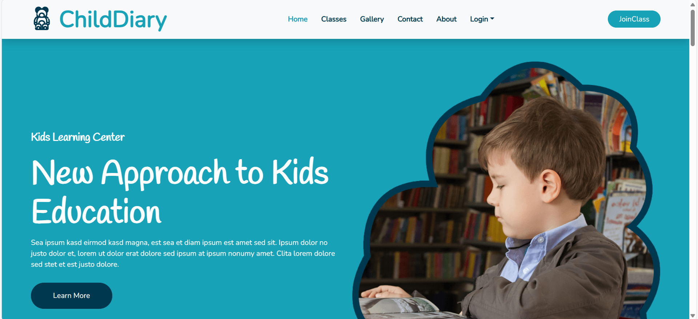
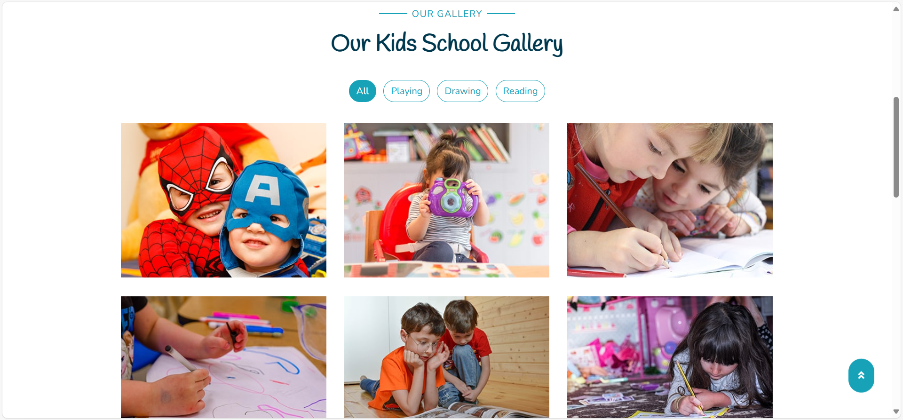
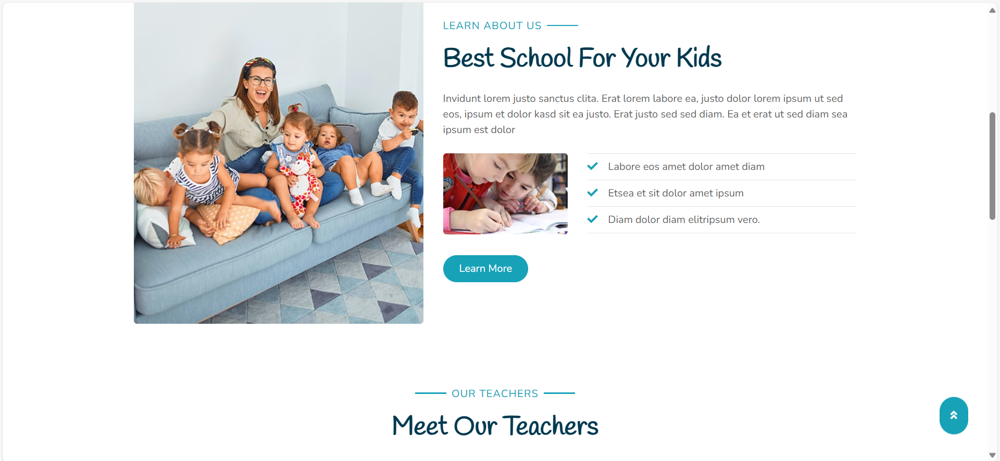
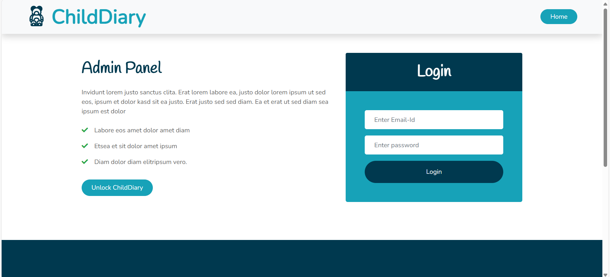
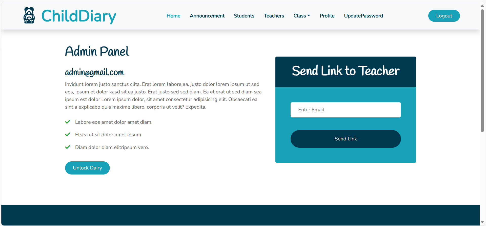
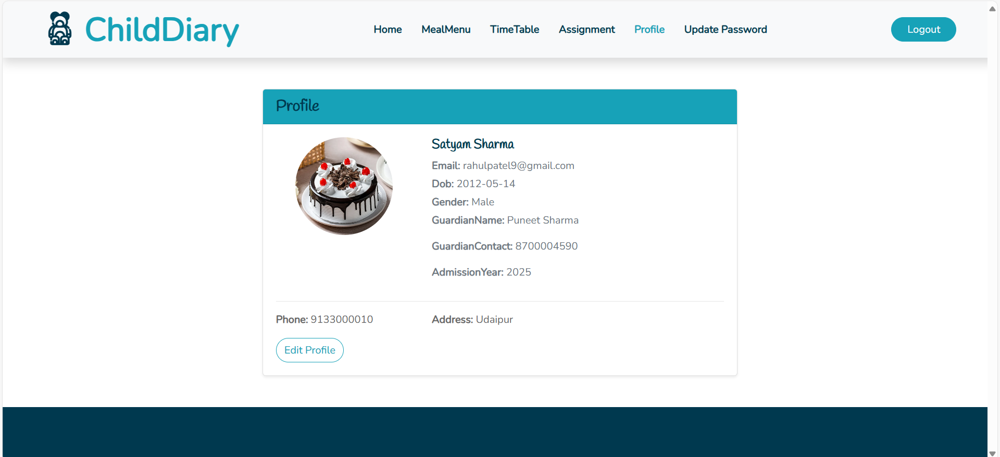
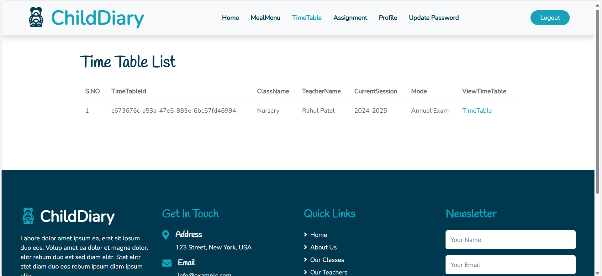

# Child_Dairy

 It is a full-stack web application developed to support the education of lower-class students. The platform features public and protected pages and supports role-based access for students, teachers, and admins. It allows teachers to manage educational content, students to view their tasks, and admins to oversee the system and verify user registrations.
 
## Set Instructions

Before running the project, make sure you have the following installed:

- **Node.js** (v16 or higher)
- **npm** or **yarn**
- **MongoDB** (running locally or using a cloud service like MongoDB Atlas)

You will also need to create a `.env` file for the backend with your own secrets.

## 🖼️ Screenshots of projects

### Home Page  

### Gallery Page  

### About Page  

### Login Page  

### Admin Dashboard Page

### Profile Page  

### Add Announcement Page  

### View Time-Table Page  

For more Screenshorts please visit ScreenShorts folder of the project

## Tech Stack

### Frontend 
- **EJS Template** (for render)
- **JavaScript** for dynamically handle pages
- **Axios** for API calls
- **CSS** used CSS Modules (for styling)

### Backend 
- **Node.js** + **Express**
- **JWT** for authentication
- **bcrypt** for password hashing
- **MongoDB** (via Mongoose)
- **NodeMailer** (via to send the mail or link)

## 📌 Features

- **Three Types of Logins**
  - **Admin**: Manages the platform and approves users
  - **Teacher**: Uploads tasks and manages student data
  - **Student**: Views assigned tasks and interacts with content

- **Authentication & Authorization**
  - Role-based access
  - Public and protected pages
  - Admin verification for student and teacher registration

- **Content Management**
  - Teachers can upload and manage assignments
  - Students can access personalized dashboards

